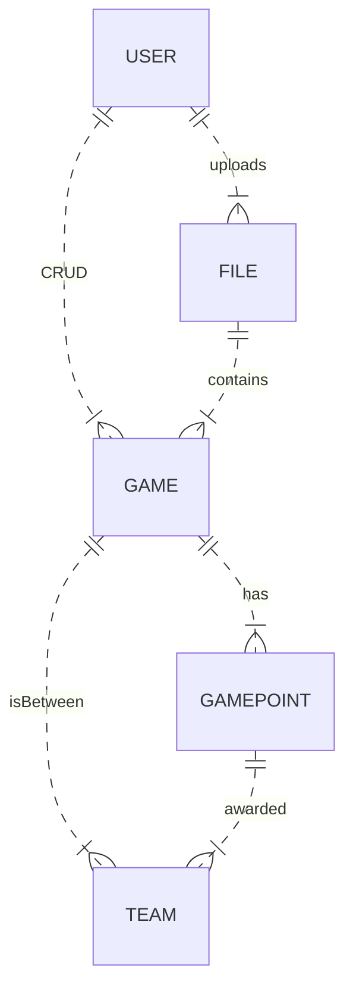

### Sports League

##### Getting started
- Pull the latest main branch
- Install python virtual environment for python 3.9: `sudo apt install python3.9-venv`
- Create python virtual environment: `python3.9 -m venv venv`
- Activate the python virtual environment: `source venv/bin/activate`
- Install all the dependencies specified at the requirements: `pip install -r requirements.txt`
- Run `python manage.py makemigrations` to create migration files and initialize sqlite db
- Run `python manage.py migrate` to migrate migrations files
- Run `python manage.py test` to test
- Run `python manage.py runserver` to start development server

#### WIKI
- Snapshot of pages here: https://github.com/NagaSolo/makmalharimau/wiki

#### Documentation 

##### Stories
- User can upload well formed CSV file
- System should be able to process CSV files and output ranking
- User can edit, delete and add game to the generated list via web interface
- User can display the ranking table based on the uploaded data.
- System should rank the teams by their points then alphabetically if points are equal
- System awards 1 point if it is a draw, 3 points if it the team won and no point for loser

##### Requirements
- Implementation framework: Django.
- Allow the user to upload a CSV file containing the results of the games and display the ranking table based on the uploaded data.
- Allow the user to add, edit, and delete games from the list through the web interface.
- Include unit tests for the Django models and views.
- Document any steps necessary to run the web application and the tests.
- Use the following minimum versions:
    - Python: 3.9
    - Django: 3.2

##### Considerations
- As the DB is not specified, I'll be using the default SQLite database for POC
- It'd be better to make use of docker actually to eliminate "it's running on my computer issues", however doing it traditionally for now. 

##### ERD
- Based on questions and requirements, following entities will be included:

##### Work Log
- Configure wsl by installing python3.9, python3.9-dev, python3.9-venv
- Create python3.9 virtualenv with `python3.9 -m venv venv`
- Verify virtual environment are using python 3.9 `python --version`
- Create `requirements.txt` and include `Django==3.2.18`
- Planned simple entity relationship diagram
- Start project named `sportsleague`
- Start app named `rankings`
- Created basic model based on erd
- Define simple testcases
- Modified model accordingly
- Configure settings to include app urls
- Testing homepage view and template
- Testing csv upload view and template
- Testing csv update view and template
- Testing temporary rankings view and template
- Fixed logic for updating the scores

##### 2nd Sprint
- Styling the template with CSS frameworks
- User can save the game to DB after satisfied with the rankings
- User can display overall rankings based on aggregated past uploaded CSV